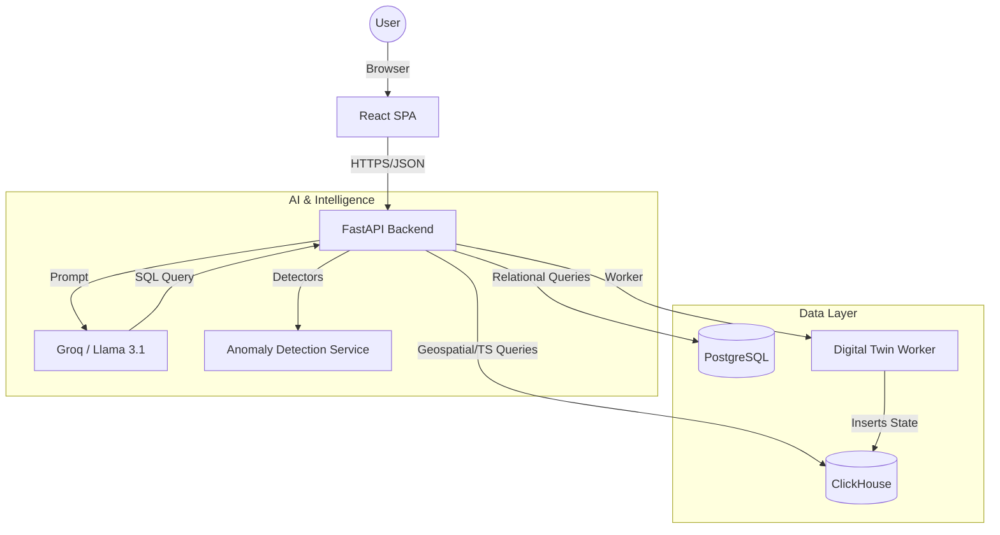

# Maritime Digital Twin Systems - Technical Documentation

## 🚢 Project Overview
**Maritime Digital Twin Systems** is a state-of-the-art platform designed for real-time fleet monitoring, predictive simulation, and advanced maritime analytics. It leverages a hybrid database architecture and Large Language Models (LLMs) to provide actionable insights into vessel behavior, environmental impact, and operational anomalies.

---

## 🛠️ Technology Stack

### **Frontend**
- **Framework**: [React 18](https://reactjs.org/) (TypeScript)
- **Build Tool**: [Vite](https://vitejs.dev/)
- **Mapping**: [Leaflet](https://leafletjs.com/) & [React-Leaflet](https://react-leaflet.js.org/)
- **Icons**: [Lucide React](https://lucide.dev/)
- **Styling**: Vanilla CSS (Modern, Responsive Design)
- **State Management**: React Hooks & Context API

### **Backend**
- **Framework**: [FastAPI](https://fastapi.tiangolo.com/) (Python 3.10+)
- **ORM**: [SQLAlchemy](https://www.sqlalchemy.org/) (for PostgreSQL)
- **Database Clients**: `clickhouse-connect` (for ClickHouse)
- **Task Management**: Python `threading` & `concurrent.futures`

### **Databases (Hybrid Strategy)**
- **PostgreSQL**: 
  - *Purpose*: Relational data, user accounts, metadata, historical anomaly events, and emission logs.
  - *Strengths*: ACID compliance, complex relational queries.
- **ClickHouse**: 
  - *Purpose*: High-volume AIS (Automatic Identification System) data, real-time vessel positions, and Digital Twin simulation states.
  - *Strengths*: Sub-second queries on billions of rows, optimized for time-series and geospatial data.

### **AI & Machine Learning**
- **LLM Engine**: [Groq](https://groq.com/) API using **Llama 3.1 8B Instant**.
- **Capabilities**:
  - **Text-to-SQL**: Converts natural language queries into complex PostgreSQL/ClickHouse SQL.
  - **Data Summarization**: Translates raw database rows into professional maritime reports.
- **Anomaly Detection**: Custom heuristic and statistical algorithms for identifying vessel behavior patterns.

---

## 🏗️ System Architecture

---

## ✨ Feature Deep Dive

### **1. Real-Time Vessel Tracking**
- **How it works**: Fetches the latest AIS data from ClickHouse.
- **Details**: Uses Leaflet for rendering 40,000+ vessels. Implements **Area-Based Filtering** (Bounding Box) to ensure only visible vessels are loaded, maintaining high performance.
- **Key Metrics**: MMSI, Latitude, Longitude, Speed Over Ground (SOG), Course Over Ground (COG).

### **2. Digital Twin & Simulation**
- **How it works**: A background worker (`twin_worker.py`) runs every 5 minutes (or on-demand).
- **Physics Engine**: Predicts future vessel positions based on current speed, heading, and historical performance.
- **Scenario Simulation**: Users can trigger "Storm" or "Detour" scenarios to see how a vessel's route and ETA change under different conditions.

### **3. Anomaly Detection System**
Integrated detection for 8 critical maritime scenarios:
1.  **Speed Violation**: Vessel exceeding safe or regulated speeds.
2.  **Emission Spike**: Unusual CO2 output relative to speed.
3.  **AIS Signal Gap**: Missing position reports (possible AIS disabling).
4.  **Dark Ship**: Vessel with zero speed and no signal in active areas.
5.  **Geofence Breach**: Entering or exiting restricted zones.
6.  **Course Deviation**: Moving significantly away from the planned route.
7.  **Draught Change**: Sudden change in cargo depth (possible illegal loading/unloading).
8.  **Sudden Speed Drop**: Potential mechanical failure or collision.

### **4. Carbon & Emissions Analytics**
- **Monitoring**: Real-time CO2 and fuel consumption tracking.
- **Prediction**: Uses historical data to forecast future emissions based on speed and route.
- **Compliance**: Helps fleet managers meet environmental regulations by identifying "Top Polluters."

### **5. Maritime AI Assistant (Chatbot)**
- **Interface**: A natural language chat interface.
- **RAG (Retrieval-Augmented Generation)**: The system feeds the database schema (50+ columns across multiple tables) into the LLM.
- **SQL Execution**: The LLM generates the SQL, the backend executes it (Postgres or ClickHouse), and the LLM summarizes the results.
- **Example**: *"Show me vessels in the Gulf of Mexico with speed > 20 knots."*

---

## 🚀 Getting Started

### **Backend Setup**
1. Install dependencies: `pip install -r requirements.txt`
2. Configure `.env` with API keys (Groq, DB URLs).
3. Start API: `python -m app.main` or `uvicorn app.main:app --reload`

### **Frontend Setup**
1. Navigate to directory: `cd frontend`
2. Install packages: `npm install`
3. Run dev server: `npm run dev`

---

## 🔒 Security & Performance
- **CORS Management**: Secured cross-origin requests.
- **Parallel Processing**: Anomaly detectors run in a `ThreadPoolExecutor` for efficiency.
- **Pagination**: All large datasets (Vessels, Anomalies) use server-side pagination (Limit/Offset).

---

## 🧮 Mathematical Formulas & Logic

### **1. Vessel Tracking & Distance (The Haversine Method)**
**Goal:** Calculate the exact distance between two GPS coordinates on the Earth's curved surface.
- **In Plain English:** Imagine a string stretched across a globe. This formula calculates the length of that string between two points, accounting for the fact that the Earth is a sphere, not a flat map.
- **The Calculation:** 
  1. We take the **Latitude** and **Longitude** of two points.
  2. We calculate the difference between them in radians.
  3. We apply the **Haversine formula** to find the "Great Circle Distance."
  4. The result is converted into **Nautical Miles (NM)** for maritime standard.

### **2. Emission Calculation Engine (The Cubic Law)**
**Goal:** Estimate how much fuel a ship is burning and how much CO₂ it is producing based on its current speed.
- **Step A: Engine Load**
  - **In Plain English:** A ship's engine works much harder to go faster. If you double the speed, the power required doesn't just double—it triples (this is the "Cubic Law").
  - **Formula:** `Load = (Current Speed / Design Speed)³`
  - *Example: If a ship's max speed is 20 knots but it's going 10 knots, it's only using ~12.5% of its engine power.*
- **Step B: Fuel Consumption**
  - **Logic:** Once we know the load, we multiply it by the engine's size (**MCR**) and its efficiency (**SFC**).
  - **Formula:** `Fuel (kg/h) = Load × Max Engine Power × Efficiency Factor`
- **Step C: Gas Totals**
  - **Logic:** For every 1 kg of fuel burned, we calculate the standard chemical output:
    - **CO₂:** Fuel × 3.206 kg
    - **NOx:** Fuel × 0.087 kg
    - **SOx:** Fuel × 0.054 kg

### **3. Digital Twin Simulation (Path Prediction)**
**Goal:** Predict where a ship will be in the future if it maintains its current course and speed.
- **Goal:** Predict next position.
- **In Plain English:** We take the current GPS position, the ship's heading (direction), and its speed. We "push" the ship forward along that line for a set amount of time (e.g., 5 minutes) to find the next coordinate.
- **Real-World Variance:** To make the simulation realistic, the system adds a **$\pm 10\%$ speed fluctuation** at every step, simulating waves, wind, and current changes.

### **4. Anomaly Detection Logic (Safety Thresholds)**
The system automatically flags "Anomalies" when a vessel's behavior crosses specific safety or operational limits:

| Anomaly Type | When it triggers (Threshold) | Why it matters |
| :--- | :--- | :--- |
| **Speed Violation** | Speed is 20% higher than the vessel's design limit. | Prevents engine damage and legal violations. |
| **Emission Spike** | CO₂ output is 2x higher than the average for that ship type. | Identifies inefficient engines or low-quality fuel. |
| **AIS Signal Gap** | No GPS update received for more than 4 hours. | Early warning for potential equipment failure. |
| **Dark Ship** | No GPS update received for more than 24 hours. | Security alert: Vessel may have intentionally cut communications. |
| **Course Deviation** | Ship turns more than 45° away from its expected route. | Identifies navigation errors or potential hijacking/piracy. |
| **Draught Change** | Ship's depth in water changes by more than 0.5 meters. | Detects illegal loading or unloading of cargo at sea. |
| **Sudden Speed Drop**| Ship speed drops by more than 5 knots instantly. | Indicates potential engine failure or collision. |
| **Geofence Breach** | Ship enters a restricted or protected environmental zone. | Prevents entry into prohibited zones (e.g., coral reefs). |

---

## 🛰️ API Reference

### **🚢 Vessel Tracking (`/api/tracking`)**
| Method | Endpoint | Summary |
| :--- | :--- | :--- |
| `GET` | `/live` | Most recent AIS positions for all vessels, enriched with live engine load and emissions. |
| `GET` | `/search` | Search vessels by name/MMSI and filter by type or speed range. |
| `GET` | `/{mmsi}/history` | Time-ordered track points with segment distance and cumulative emissions. |
| `GET` | `/{mmsi}/speed-profile` | Hourly SOG buckets with idle% and comparison against design speed. |
| `GET` | `/{mmsi}/day-summary` | Day-by-day activity with distance estimates and bounding boxes. |
| `GET` | `/{mmsi}/profile` | Snapshot combining AIS identity, engine profile, and live emission state. |
| `GET` | `/{mmsi}/emission-track` | Every track point with instantaneous CO₂ for map color-coding. |

### **🤖 AI Chatbot (`/api/chat`)**
| Method | Endpoint | Summary |
| :--- | :--- | :--- |
| `POST` | `/` | Natural language interface. Accepts `message` and `history` to return SQL and summaries. |

### **🏗️ Digital Twin (`/twin`)**
| Method | Endpoint | Summary |
| :--- | :--- | :--- |
| `GET` | `/vessels` | Latest simulation state for all vessels (paginated). |
| `GET` | `/vessels/area` | Vessels within a geographic bounding box (for map viewport optimization). |
| `GET` | `/state/{mmsi}` | Full real + simulated state for one vessel, including predicted route waypoints. |
| `POST` | `/sync` | Manually trigger a refresh cycle for all vessel trajectory predictions. |
| `POST` | `/simulate` | Run a named scenario (STORM, DETOUR, NORMAL) for a specific vessel. |

### **⚠️ Anomaly Detection (`/api/anomaly`)**
| Method | Endpoint | Summary |
| :--- | :--- | :--- |
| `POST` | `/detect` | Runs the 8-detector suite across a time window and persists new anomalies. |
| `GET` | `/fleet` | Returns all active/resolved anomalies for the entire fleet (paginated). |
| `GET` | `/summary` | KPI counts categorized by severity (Critical, High, Medium, Low). |
| `GET` | `/map/overlay` | Anomaly markers with coordinates for real-time map alerts. |
| `GET` | `/{mmsi}` | All historical and active anomalies for a single vessel. |
| `PUT` | `/{anomaly_id}/resolve` | Marks a specific anomaly as resolved. |
| `DELETE` | `/{anomaly_id}` | Removes an anomaly record from the database. |

### **🌱 Carbon Emissions (`/carbon`)**
| Method | Endpoint | Summary |
| :--- | :--- | :--- |
| `GET` | `/vessel_profiles` | Lists design and engine specifications for various vessel categories. |
| `POST` | `/calculate` | Triggers a fresh calculation of CO₂/fuel usage for the entire fleet. |
| `POST` | `/predict` | Runs the predictive model to forecast future fleet emissions. |
| `GET` | `/vessel/{mmsi}` | Retrieves the complete emission history for a specific vessel. |
| `GET` | `/top_polluters` | Ranking of vessels with the highest cumulative CO₂ output. |
| `GET` | `/fleet_summary` | Fleet-wide emission statistics broken down by vessel type. |
| `GET` | `/zones` | Lists all defined geofence zones for local emission tracking. |
| `POST` | `/zones` | Creates a new zone using GeoJSON coordinates. |
| `GET` | `/zones/{zone_name}/emissions` | Aggregates emission totals within a specific geographic zone. |
